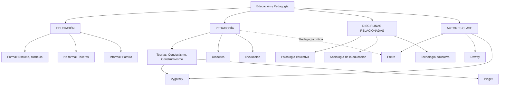

```mermaid
graph TD;
    A[Educación y Pedagogía] --> B[EDUCACIÓN]
    A --> C[PEDAGOGÍA]
    A --> D[DISCIPLINAS RELACIONADAS]
    A --> E[AUTORES CLAVE]
    
    B --> B1[Formal: Escuela, currículo]
    B --> B2[No formal: Talleres]
    B --> B3[Informal: Familia]
    
    C --> C1[Teorías: Conductismo, Constructivismo]
    C --> C2[Didáctica]
    C --> C3[Evaluación]
    
    D --> D1[Psicología educativa]
    D --> D2[Sociología de la educación]
    D --> D3[Tecnología educativa]
    
    E --> E1[Freire]
    E --> E2[Dewey]
    E --> E3[Vygotsky]
    
    C1 --> E3
    C1 --> E4[Piaget]
    C -.->|Pedagogía crítica| E1

```
